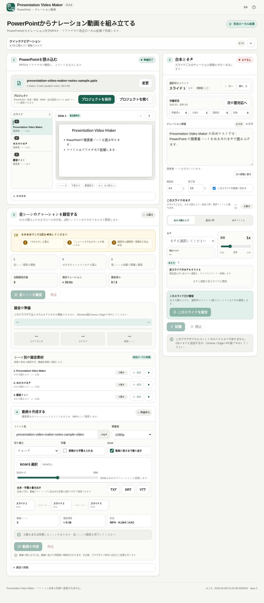

# Presentation Video Maker

[](https://github.com/ttomohisa/htmlapps-presentation-video-maker/actions/workflows/deploy-pages.yml)
[](LICENSE)
[](https://ttomohisa.github.io/htmlapps-presentation-video-maker/)

[English README](README.md)

PowerPoint（PPTX）をブラウザで読み込み、ナレーション付きMP4へ変換する、単一HTML・完全ローカル処理のツールです。端末内読み上げ、自分の声、ローカル音声ファイルをスライドごとに使い分け、作業をローカル `.pvm` プロジェクトとして保存・再開できます。PPTX・発表者ノート・音声・BGM・プロジェクト・生成動画をアプリからサーバーへ送信しません。

## 🚀 デモ

### [GitHub PagesでPresentation Video Makerを開く](https://ttomohisa.github.io/htmlapps-presentation-video-maker/)

GitHub Pages版では最初のHTML取得だけ通信します。読み込み後のPPTX解析、発表者ノート抽出、スライド描画、台本編集、音声処理、動画組み立て、MP4変換は端末内で行います。アプリで選択したファイルはアップロードしません。

[](https://ttomohisa.github.io/htmlapps-presentation-video-maker/)

## 主な機能

- **発表者ノートをそのままナレーション台本に** — 1スライドを1シーンとして扱い、ノートがあれば台本へ、なければスライド本文を下書きとして使用します。
- **スライドごとに音声方式を選択** — 端末内読み上げ、自分の声（マイク録音）、既存のローカル音声ファイルを同じプレゼン内で混在できます。端末内読み上げは選択中の1スライドだけ録音することも、全シーンをまとめて録音することもできます。
- **途中保存してあとから再開** — 元のPowerPoint、台本、録音、BGM、出力設定をローカル `.pvm` プロジェクトにまとめて保存し、あとから続きを開けます。生成済みMP4はプロジェクト内へ重複保存しません。
- **未完了シーンをすぐ見つける** — 録音済み・未録音・再録音・失敗を集計し、「次の要対応」で修正が必要なシーンへ移動できます。
- **台本・字幕を書き出し** — 台本をTXT、現在の動画タイムラインに合わせた字幕をSRT / VTTでローカル保存できます。
- **ナレーションをシーン単位で編集** — 台本、動画への含有、前後余白、音声、読み上げ速度を保持し、設定変更後は古い録音を削除せず「再録音が必要」として管理します。
- **PowerPointを高品質表示** — `@aiden0z/pptx-renderer@1.2.4` でプレビューし、動画用スナップショットは `html2canvas@1.4.1` でorigin-clean Canvasへ変換します。
- **MP4までブラウザ内で作成** — 720p / 1080p、カット / フェード、字幕焼き込み、ローカルBGMに対応し、同梱FFmpeg WASMでH.264/AAC MP4へ変換します。
- **PC / スマートフォン対応** — 4工程のクイックナビゲーション、スライド移動、録音状態、長い音声名、スマホ下部タブを整理し、狭い画面でも横スクロールしない構成です。
- **単一HTML・完全ローカル処理** — 必要なランタイムをHTMLへ埋め込み、日本語 / 英語UI、`connect-src 'none'`、実行時CDNなし、解析・テレメトリなし、クラウドTTS APIなしで動作します。

## クイックスタート

### Webデモを使う

[GitHub Pages版](https://ttomohisa.github.io/htmlapps-presentation-video-maker/)を開くだけです。登録・インストールは不要です。

### 単一HTMLを使う

1. GitHub Actions / Release成果物から `dist/index.html` を取得するか、下記手順でローカルビルドします。
2. 現行のChromium系ブラウザで開きます。
3. Windowsの端末内読み上げを録音する場合は、アプリの案内に従って **「画面全体」** を選び、**「システム音声も共有」** を有効にします。

### 完全埋め込み版を自分でビルドする

1. Windowsでこのリポジトリをダウンロードまたはcloneします。
2. 初回は `prepare-and-build.bat` を実行します。
3. `dependencies.json` で固定した依存を取得し、lockとSHA-256を検証して単一HTMLへ埋め込みます。
4. 依存準備後の通常ビルドは `build-standalone.bat` を使用できます。
5. 生成された `dist/index.html` を好きな場所へコピーして利用できます。

通常のWindowsビルドにNode.js、Python、ローカルWebサーバーは不要です。PowerShellとWindows標準の `tar.exe` を使用します。

## 使い方

1. 新しく作る場合は `.pptx` をドロップするか「PowerPointを選択」から読み込みます。以前の作業を続ける場合は、PowerPointとは分けて表示される **「保存した作業を再開」** から `.pvm` プロジェクトを選びます。PPTXの上限は150 MBです。
2. スライドを選び、高品質プレビューとナレーション原稿を確認します。
3. 台本、開始前 / 終了後の余白、動画へ含めるかどうかを編集します。
4. 各スライドで **端末内読み上げ / 自分の声 / 音声ファイル** を選びます。
5. 端末内読み上げではOSのローカル音声と0.8x〜1.5xの速度を指定し、**「このスライドを録音」** で選択中の1枚だけ、または **「全シーンを録音」** でTTS対象をまとめて録音できます。確認済みのWindows経路では **「画面全体 + システム音声」** を共有します。
6. 自分の声では選択中スライドだけをマイク録音します。音声ファイルでは端末内の既存音声を選択します。
   **「シーン別の録音素材」** の各行からも、そのシーンの録音・停止・音声ファイル差し替えを直接行えます。
7. 作業状況と **「次の要対応」** を使って、未録音・再録音・失敗のシーンを順番に確認します。これらが残っている場合は動画作成を開始できません。
8. 途中で止める場合は **「プロジェクトを保存」** から `.pvm` を保存します。自動保存はしません。
9. 720p / 1080p、カット / フェード、字幕、BGM、BGM音量・ループを設定します。出力画面からTXT / SRT / VTTも保存できます。
10. 動画を作成し、MP4をプレビューしてファイル名を指定して保存します。

3スライドのサンプルPPTXや回帰用データは `test-data/` に含まれています。


## プロジェクト保存と台本・字幕書き出し

`.pvm` はPresentation Video Maker専用のローカル作業ファイルです。元のPPTX、シーンごとの台本・設定、録音素材、BGM、動画出力設定をまとめて保持します。生成済みMP4は再生成できるため、プロジェクトには含めません。

`.pvm` の作成・読み込みもブラウザ内だけで行い、プロジェクト内容を外部へ送信しません。自動保存ではないため、再開ポイントを残したいタイミングで明示的に保存してください。

出力画面では次もローカル保存できます。

- `TXT` — スライド単位のナレーション台本
- `SRT` — 現在のシーン/動画タイムラインに合わせた字幕
- `VTT` — 同じタイミングをWebVTT形式で出力した字幕

録音済み・実測済みシーンではその時間を使い、未計測シーンでは現在の推定時間を使って字幕タイミングを計算します。

## 動画生成の仕組み

動画は完全ローカルで2段階に生成します。

1. スライドを描画し、Canvas / Web Audio上でナレーション、字幕、フェード、BGMをタイムラインに合わせて再生しながらMediaRecorderで中間WebMを作成します。この工程はタイムラインを実際に再生して録画するため、おおむね動画の長さと同程度の時間がかかります。
2. 同梱している FFmpeg WASM Builder v1.6.0 `video-compressor` のランタイムで、中間WebMをH.264/AAC MP4へ変換します。

新しい動画が正常に完成するまでは、以前に作成したMP4を保持します。出力設定を変更した場合は「以前の設定で作成された動画」として残り、再生成をキャンセル・失敗した場合も前の成功済みMP4は消えません。

## PowerPoint表示

高品質プレビューには次を使用します。

```text
@aiden0z/pptx-renderer@1.2.4
```

動画用スナップショットには次も使用します。

```text
html2canvas@1.4.1
```

どちらもバージョンを固定し、SHA-256 lockを作成してビルド時だけ取得し、生成HTMLへ埋め込みます。動画側は `foreignObjectRendering: false` を使用し、`file://` / opaque originで発生したSVG `foreignObject` 経由のCanvas汚染を避けています。

## GitHub Pagesで公開する

リポジトリには `dist/` をビルドしてGitHub Pagesへ配信するworkflowが含まれています。

1. `ttomohisa/htmlapps-presentation-video-maker` としてGitHubへpushします。
2. **Settings → Pages → Build and deployment → Source** で **GitHub Actions** を選択します。
3. `main` へpushするか、Actionsから **Deploy standalone app to GitHub Pages** を手動実行します。
4. デプロイ成功後は `https://ttomohisa.github.io/htmlapps-presentation-video-maker/` で利用できます。

デプロイ時も固定依存から単一HTMLを再生成し、検証後に公開します。

## 開発・ビルド構成

```text
.
├─ src/index.template.html                 # アプリ本体テンプレート
├─ app.config.json                         # アプリ情報・リリース版数
├─ dependencies.json                       # 固定するブラウザ依存
├─ dependencies.lock.json                  # 解決済み依存・ハッシュ
├─ vendor/ffmpeg-video-compressor-v1.6.0/  # FFmpegランタイム
├─ build-standalone.bat                    # 通常ビルド
├─ prepare-and-build.bat                   # 依存準備 + ビルド
├─ dist/index.html                         # 読みやすい単一HTML
├─ dist/index.self-extract.html            # 圧縮自己展開版
└─ .github/workflows/
   ├─ build-standalone.yml                 # PR時の検証
   ├─ dependency-updates.yml               # 依存更新チェック
   └─ deploy-pages.yml                     # GitHub Pages配信
```

### 依存を更新する

`dependencies.json` の固定バージョンを更新し、次を実行します。

```bat
prepare-and-build.bat
```

ビルドでは以下を行います。

- npm tarballをビルド時だけ取得
- `dependencies.lock.json` にSHA-256を記録・検証
- PowerPoint rendererとhtml2canvasを単一HTMLへ埋め込み
- MP4変換用FFmpeg runtime/coreを埋め込み
- 未解決placeholderや実行時外部script / stylesheetを検出
- `dist/dependency-manifest.json` を生成
- 自己展開版単一HTMLを生成・検証

## プライバシー / 外部通信

HTML読込後は **完全ローカル処理** を前提としています。

- PPTXはブラウザのメモリ内で読み込みます。
- 発表者ノート、台本、`.pvm` プロジェクトはサーバーへ送りません。
- マイク録音、システム音声録音、ローカル音声ファイル、BGMは端末内に留まります。
- 中間WebMと生成MP4も外部送信しません。
- CSPは `connect-src 'none'` を維持します。
- 実行時CDN、アクセス解析、テレメトリ、クラウドTTS API、外部フォントを使用しません。

GitHub Pages版は最初のHTML取得には通信が必要です。ネットワークなしで利用する場合は、生成済み `dist/index.html` をローカルで開いてください。

## 制限事項

- PowerPointのアニメーションは静止状態で表示し、再生しません。
- PowerPoint本体のスライド切り替え効果は再現せず、動画出力ではアプリ独自のカット / フェードを使用します。
- PowerPointへ埋め込まれた音声・動画は再生しません。
- Microsoft PowerPointとの完全なピクセル一致は保証しません。
- Web Speech APIの音声とシステム音声共有はOS・ブラウザ依存です。確認済みのTTS録音方式はWindowsの **「画面全体 + システム音声」** です。
- システム音声にはWindows通知や他アプリの音も入る可能性があります。
- `.pvm` は明示的に保存するローカル作業ファイルで、プレゼン内容をLocalStorage / IndexedDBへ自動保存しません。
- SRT / VTTのタイミングは現在のアプリ内タイムラインを基準にし、未録音・未計測シーンでは推定ナレーション時間を使う場合があります。
- MediaRecorderでタイムラインを再生しながら動画を組み立てるため、FFmpeg変換前におおむね動画の長さと同程度の時間がかかります。
- 大きなPPTX、複雑なスライド、1080p動画は端末メモリを多く使用する場合があります。
- 現在はPPTX 1ファイル最大150 MB、ナレーション/BGM音声は各100 MBまでです。

## 依存ライブラリ

| ライブラリ / ランタイム | バージョン | ライセンス | 用途 |
| --- | ---: | --- | --- |
| @aiden0z/pptx-renderer | 1.2.4 | Apache-2.0 | PPTX解析・高品質DOM/SVGプレビュー |
| html2canvas | 1.4.1 | MIT | 動画用スライドをorigin-clean Canvasへ変換 |
| FFmpeg WASM Builder生成core | Builder 1.6.0 / `video-compressor` | GPL-2.0-or-later | H.264/AAC MP4変換 |

FFmpeg / x264の固定revisionと対応ソースについては [THIRD_PARTY_NOTICES.md](THIRD_PARTY_NOTICES.md) を参照してください。

## Contributing

不具合報告・機能提案はGitHub Issuesで受け付けます。開発方法は [CONTRIBUTING.md](CONTRIBUTING.md) を参照してください。

## License

Copyright © 2026 ttomohisa

[GNU General Public License v3.0](LICENSE) で公開します。
