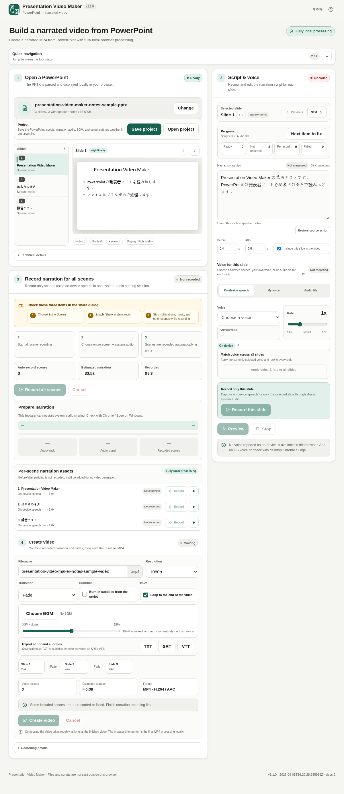

# Presentation Video Maker

[](https://github.com/ttomohisa/htmlapps-presentation-video-maker/actions/workflows/deploy-pages.yml)
[](LICENSE)
[](https://ttomohisa.github.io/htmlapps-presentation-video-maker/)

[日本語版 README](README.ja.md)

A privacy-focused, single-HTML app for turning a PowerPoint (PPTX) deck into a narrated MP4 in the browser. Use on-device speech, your own microphone recording, or local audio files, save/resume the work as a local `.pvm` project, and export scripts/subtitles without uploading the presentation, narration, BGM, project, or generated video to the app.

## 🚀 Live demo

### [Open Presentation Video Maker on GitHub Pages](https://ttomohisa.github.io/htmlapps-presentation-video-maker/)

GitHub Pages delivers the initial HTML. After it loads, PPTX parsing, speaker-note extraction, slide rendering, narration editing, audio handling, video composition, and MP4 conversion are processed locally on your device. Files selected in the app are not uploaded by the app.

[](https://ttomohisa.github.io/htmlapps-presentation-video-maker/)

## Features

- **Turn speaker notes into narration** — Each PowerPoint slide becomes one scene, with speaker notes used as the initial script and slide text used as a fallback draft when notes are missing.
- **Choose narration per slide** — Mix on-device Web Speech API voices, microphone recordings, and existing local audio files in the same presentation. On-device speech can be captured for only the selected slide or in one all-scene batch.
- **Resume work later** — Save the source PowerPoint, scripts, narration recordings, BGM, and output settings into a local `.pvm` project and open it later. Project data is not uploaded and generated MP4 is not duplicated inside the project.
- **Find unfinished narration quickly** — See ready/unrecorded/stale/failed counts and jump directly to the next scene that needs attention.
- **Export scripts and subtitles** — Save the current scripts as TXT or export the current video timeline as SRT / VTT for use outside the app.
- **Keep narration work editable** — Adjust scripts, include/exclude slides, before/after padding, voice, and speech rate, with stale-audio tracking when narration settings change.
- **Preview PowerPoint with higher fidelity** — Use pinned `@aiden0z/pptx-renderer@1.2.4` for the main slide preview and `html2canvas@1.4.1` for origin-clean video snapshots.
- **Create a finished MP4 locally** — Choose 720p or 1080p, Cut or Fade, burned-in subtitles, and optional local BGM, then create H.264/AAC MP4 through the embedded FFmpeg WASM runtime.
- **Work comfortably on desktop and mobile** — Four-step quick navigation, responsive scene editing, smartphone bottom navigation, clear recording states, long-name wrapping, and no horizontal page overflow at supported narrow widths.
- **Private, single-HTML operation** — Runtime libraries are embedded, the UI is Japanese/English, and the app keeps `connect-src 'none'` with no runtime CDN, analytics, telemetry, or cloud TTS API.

## Quick start

### Use the web demo

Open the [GitHub Pages demo](https://ttomohisa.github.io/htmlapps-presentation-video-maker/). No account or installation is required.

### Use the single HTML file

1. Download `dist/index.html` from a GitHub Actions / release artifact, or build it locally with the steps below.
2. Open it in a current Chromium-based browser.
3. For the Windows Web Speech API recording workflow, follow the in-app instructions to share **Entire Screen** and enable **system audio** when requested.

### Build a fully embedded file yourself

1. Download or clone this repository on Windows.
2. Double-click `prepare-and-build.bat` for the first build.
3. The builder downloads the exact dependency versions pinned in `dependencies.json`, verifies the lock data, and embeds them into the standalone HTML.
4. After dependencies are prepared, `build-standalone.bat` can be used for normal rebuilds.
5. Copy `dist/index.html` wherever you need it.

Node.js, Python, and a local web server are not required for the normal Windows build. The repository build uses PowerShell and the built-in `tar.exe`.

## Usage

1. Start a new video by dropping one `.pptx` file or choosing it with the PowerPoint picker. To continue previous work, use the separate **Resume saved work** card and choose a `.pvm` project. The two file pickers are intentionally separate. The current PPTX limit is 150 MB.
2. Select a slide and review the high-fidelity preview and narration script.
3. Edit the script, before/after padding, and whether the slide is included in the video.
4. Choose **On-device speech**, **My voice**, or **Audio file** for each slide.
5. For on-device speech, choose a local OS voice and adjust the 0.8x–1.5x rate slider. Capture only the selected slide with **Record this slide**, or use **Record all scenes** for the TTS scenes in the deck. Both workflows require **Entire Screen + system audio** on the tested Windows path.
6. For microphone narration, record the selected slide directly. For local audio, choose an audio file from your device.
   The **Narration assets** scene list also provides a row-level action, so each scene can be recorded, stopped, or have its local audio replaced directly from the list.
7. Use the narration progress summary and **Next item to fix** to move through missing, stale, or failed scenes. Missing, failed, or stale narration blocks video creation.
8. Use **Save project** whenever you want a local `.pvm` snapshot that can be opened later. The app does not autosave.
9. Choose 720p/1080p, Cut/Fade, subtitles, and optional BGM with volume/loop settings. TXT, SRT, and VTT can also be saved locally from the output area.
10. Create the video, preview the generated MP4, set the output filename, and save it.

A three-slide test deck and additional regression fixtures are included under `test-data/`.


## Project files and text exports

`.pvm` is a Presentation Video Maker project file used only for explicit save/resume. It contains the source PPTX, per-scene scripts/settings, narration recordings, optional BGM, and video-output settings. The already generated MP4 is not embedded because it can be regenerated from the project.

The project container is written and read locally by the app; no project data is sent to a server. It is not an autosave format, so save a new `.pvm` file when you want a resumable checkpoint.

The output area can also save:

- `TXT` — narration scripts grouped by slide;
- `SRT` — subtitle cues using the current scene/timeline timing;
- `VTT` — the same cue timing in WebVTT format.

When a scene has a measured/recorded narration duration it is used for subtitle timing; otherwise the current duration estimate is used.

## Video creation pipeline

Video creation is fully local and uses two stages:

1. The browser renders the included slides, plays scene narration on a Canvas/Web Audio timeline, mixes optional BGM, burns subtitles, and records an intermediate WebM with MediaRecorder. This composition stage runs approximately in real time because the timeline is captured while it plays.
2. The embedded FFmpeg WASM Builder v1.6.0 `video-compressor` runtime converts the intermediate WebM to H.264/AAC MP4.

The generated MP4 replaces the previous result only after a new export succeeds. Changing output settings marks the previous video as outdated but keeps it available; a cancelled or failed replacement export also keeps the prior successful MP4.

## PowerPoint rendering

The primary preview uses:

```text
@aiden0z/pptx-renderer@1.2.4
```

Video snapshots additionally use:

```text
html2canvas@1.4.1
```

Both are pinned, SHA-256 locked, downloaded only during the repository build, and embedded into the generated HTML. The video snapshot path uses `foreignObjectRendering: false` to avoid the Canvas tainting problem observed with SVG `foreignObject` under `file://` / opaque-origin environments.

## Publish with GitHub Pages

The repository includes a workflow that builds the standalone HTML and deploys `dist/` to GitHub Pages.

1. Push the repository to GitHub as `ttomohisa/htmlapps-presentation-video-maker`.
2. Open **Settings → Pages → Build and deployment → Source** and select **GitHub Actions**.
3. Push to `main`, or manually run **Deploy standalone app to GitHub Pages** from the Actions tab.
4. After a successful deployment, the demo is available at `https://ttomohisa.github.io/htmlapps-presentation-video-maker/`.

Each deployment rebuilds the generated HTML from pinned dependencies and validates the repository before publishing.

## Development and build layout

```text
.
├─ src/index.template.html                 # Application template
├─ app.config.json                         # App metadata and release version
├─ dependencies.json                       # Pinned browser dependencies
├─ dependencies.lock.json                  # Resolved dependency hashes
├─ vendor/ffmpeg-video-compressor-v1.6.0/  # Embedded FFmpeg runtime assets
├─ build-standalone.bat                    # Normal standalone build
├─ prepare-and-build.bat                   # Dependency preparation + build
├─ dist/index.html                         # Readable single-HTML artifact
├─ dist/index.self-extract.html            # Compressed self-extracting artifact
└─ .github/workflows/
   ├─ build-standalone.yml                 # Pull-request validation
   ├─ dependency-updates.yml               # Scheduled dependency checks
   └─ deploy-pages.yml                     # GitHub Pages deployment
```

### Update dependencies

Update the pinned versions in `dependencies.json`, then run:

```bat
prepare-and-build.bat
```

To discard cached npm packages and retrieve them again, run the PowerShell builder with `-ForceDownload` through the repository build flow.

The build process:

- Downloads pinned npm tarballs during build time only
- Records and verifies SHA-256 hashes in `dependencies.lock.json`
- Embeds the PowerPoint renderer and html2canvas into the standalone HTML
- Embeds the FFmpeg runtime/core required for MP4 conversion
- Rejects unresolved build placeholders and external runtime script/style references
- Generates `dist/dependency-manifest.json`
- Generates and verifies the self-extracting single-HTML variant

## Privacy and runtime network protection

The generated app is designed for **fully local processing** after the HTML has loaded:

- Selected PPTX files are read in browser memory.
- Speaker notes, scripts, and `.pvm` project files are not sent to a server.
- Microphone recordings, system-audio recordings, local audio files, and BGM remain on the device.
- Intermediate WebM and generated MP4 data remain local.
- CSP includes `connect-src 'none'`.
- Runtime CDN, analytics, telemetry, cloud TTS APIs, and external fonts are not used.

The GitHub Pages version still requires the initial HTML request. To use the app without a network connection, open the generated `dist/index.html` locally.

## Limitations

- PowerPoint animations are shown as static content and are not replayed.
- Native PowerPoint slide transitions are not replayed; the app provides its own global Cut/Fade option for exported video.
- Embedded PowerPoint audio/video is not played.
- Exact pixel parity with desktop Microsoft PowerPoint is not guaranteed.
- Web Speech API voices and system-audio sharing behavior depend on the browser and operating system. The tested TTS capture workflow uses Windows **Entire Screen + system audio**.
- System-audio capture can include notification sounds, music, or other applications.
- `.pvm` is an explicit local save/resume file; the app does not autosave presentation content to LocalStorage or IndexedDB.
- SRT/VTT cue timing follows the current app timeline and may use estimated narration duration for scenes that have not been measured/recorded yet.
- Video composition uses MediaRecorder and therefore takes roughly the video duration before the FFmpeg MP4 conversion stage begins.
- Large or complex PowerPoint decks, high-resolution rendering, and 1080p export can consume substantial device memory.
- The current UI accepts one PPTX up to 150 MB and local narration/BGM files up to 100 MB each.

## Dependencies

| Library / runtime | Version | License | Purpose |
| --- | ---: | --- | --- |
| @aiden0z/pptx-renderer | 1.2.4 | Apache-2.0 | PPTX parsing and high-fidelity DOM/SVG preview |
| html2canvas | 1.4.1 | MIT | Origin-clean slide rasterization for video snapshots |
| FFmpeg WASM Builder generated core | Builder 1.6.0 / `video-compressor` | GPL-2.0-or-later | H.264/AAC MP4 conversion |

See [THIRD_PARTY_NOTICES.md](THIRD_PARTY_NOTICES.md) for the pinned FFmpeg/x264 revisions and corresponding-source information.

## Contributing

Bug reports and feature proposals are welcome through GitHub Issues. See [CONTRIBUTING.md](CONTRIBUTING.md) for development guidance.

## License

Copyright © 2026 ttomohisa

Licensed under the [GNU General Public License v3.0](LICENSE).
